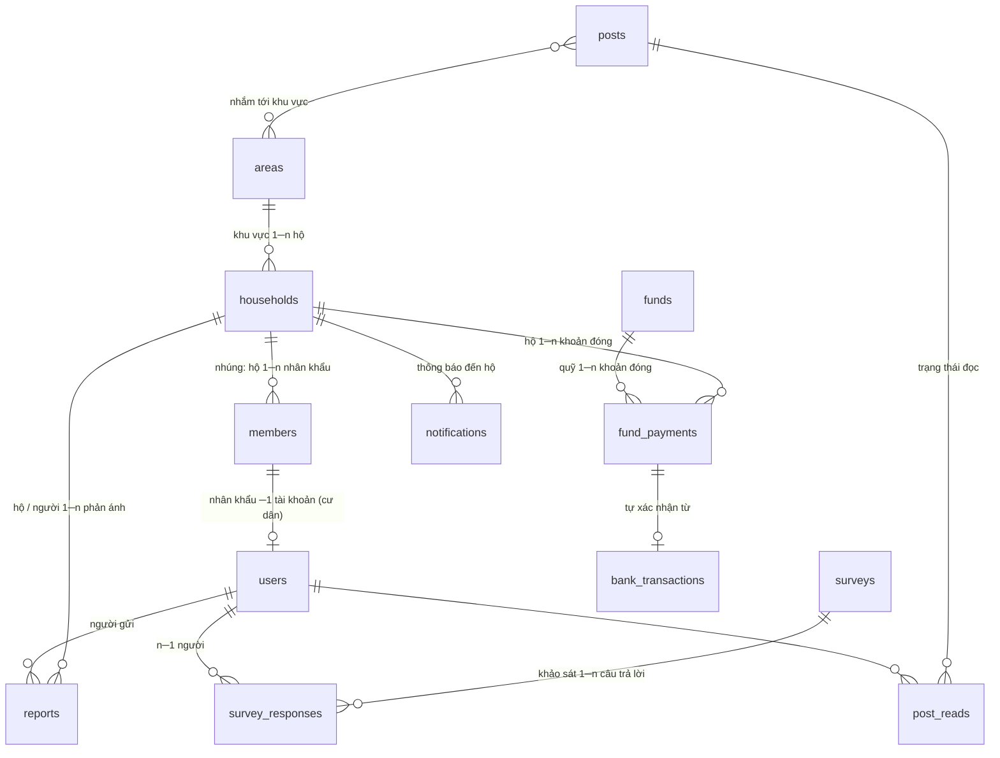

# Database — MongoDB

Thư mục này là **nơi quản trị database**: chạy MongoDB, khởi tạo, thống kê, kiểm tra, tra cứu, sao lưu, xoá.

- **Schema (model) nằm ở backend:** `backend/src/modules/*/*.model.ts` là nguồn sự thật duy nhất, danh sách ở `backend/src/models.ts`.
  Script ở đây dùng lại đúng các model đó cùng khoá mã hoá, nên không bị lệch với API.
- **Không có `node_modules` riêng:** dùng của backend, nhớ `npm install` trong `backend/` trước.

```
database/
├─ docker-compose.yml        MongoDB local
├─ package.json              lệnh tắt (gọi sang backend)
├─ backups/                  bản sao lưu (git bỏ qua — có dữ liệu mã hoá + hash mật khẩu)
└─ scripts/
   ├─ setup.ts  status.ts  stats.ts  check.ts  find.ts  add-user.ts
   ├─ backup.ts restore.ts  wipe.ts   reset.ts  sync-indexes.ts
   ├─ lib/      run (kết nối), backup, checks, random
   └─ seeds/    schema, reference, users, demo/
```

## Chạy MongoDB local

```bash
cd database
docker compose up -d          # MongoDB 8 tại localhost:27017, dữ liệu ở database/data/
```

Hoặc MongoDB Atlas: đặt chuỗi kết nối vào `MONGODB_URI` trong `.env` ở thư mục gốc.
Atlas → Network Access phải cho phép IP của máy chạy lệnh.

Database luôn là `MONGODB_DB_NAME` (mặc định **`khupho`**), kể cả khi chuỗi kết nối không ghi tên DB.
Mạng chậm thì tăng `MONGODB_TIMEOUT_MS` (mặc định 30000).

## Lệnh

Chạy trong `database/` (`npm run <lệnh>`) hoặc trong `backend/` (`npm run db:<lệnh>`). Tham số đặt sau `--`.

| Lệnh | Việc làm | Ghi / xoá? |
|---|---|---|
| `setup [-- --demo]` | Tạo collection + index, quỹ năm nay, số khẩn cấp, tài khoản. `--demo`: thêm dữ liệu mẫu (chỉ khi chưa có hộ). Chạy lại an toàn | ghi |
| `status` | Số document / index từng collection | chỉ đọc |
| `stats` | **Đếm người:** hộ, nhân khẩu theo khu vực / cư trú / giới tính / tuổi / nhóm đối tượng; tài khoản (kích hoạt, chưa kích hoạt); phản ánh; quỹ | chỉ đọc |
| `check` | **Kiểm tra dữ liệu:** khoá mã hoá đúng, khớp schema, mỗi hộ đúng 1 chủ hộ, không trùng CCCD, hộ trỏ đúng khu vực, liên kết tài khoản ↔ nhân khẩu, tạm trú quá hạn, index thiếu. Lỗi → exit code 1 | chỉ đọc |
| `find -- <SĐT / CCCD / mã hộ / họ tên>` | Tra cứu hộ, nhân khẩu và tài khoản (**giải mã** để xem) | chỉ đọc |
| `add-user -- <SĐT> <vai trò> "<Họ tên>" [--household HK-xxxx]` | Thêm tài khoản **chưa kích hoạt** (người dùng tự kích hoạt bằng OTP / mật khẩu tạm). Cư dân tự liên kết nhân khẩu cùng SĐT, hoặc liên kết chủ hộ của `--household` | ghi |
| `backup` | Sao lưu toàn bộ vào `backups/<db>-<thời gian>/` | ghi file |
| `restore [-- <bản sao lưu> --yes]` | Không tham số: liệt kê bản sao lưu. Có tham số: khôi phục, ghi đè | **ghi đè** |
| `wipe [-- --yes] [--no-backup]` | Không `--yes`: chỉ xem sẽ xoá gì. Có `--yes`: **sao lưu rồi xoá sạch DB** | **xoá** |
| `reset -- --yes [--demo] [--no-backup]` | `wipe` + `setup` trong một lệnh | **xoá** |
| `sync-indexes` | Chỉ đồng bộ index (deploy production) | ghi |

`wipe`, `reset`, `restore` bị chặn khi `NODE_ENV=production`.

### Thay dữ liệu chính (VD: nạp danh sách hộ thật thay cho dữ liệu mẫu)

```bash
cd database
npm run check                 # (tuỳ chọn) xem dữ liệu hiện tại có vấn đề gì
npm run wipe                  # xem sẽ xoá những gì
npm run wipe -- --yes         # sao lưu vào backups/ rồi xoá sạch
npm run setup                 # tạo lại cấu trúc + tài khoản (không --demo)
# … nạp dữ liệu chính …
npm run check                 # kiểm tra lại sau khi nạp
npm run stats                 # xem số hộ / số người
```

Nạp nhầm thì quay lại: `npm run restore`, chọn bản sao lưu, rồi chạy `npm run restore -- <tên> --yes`.
Bản sao lưu giữ dữ liệu **ở dạng mã hoá**, nên muốn khôi phục phải đúng `DATA_ENCRYPTION_KEY` / `DATA_INDEX_KEY` như lúc sao lưu.

## Khởi tạo — các bước của `setup`

| Bước | File (`scripts/seeds/`) | Nội dung |
|---|---|---|
| 1. Cấu trúc | `schema.ts` | Tạo mọi collection trong `backend/src/models.ts`, đồng bộ index |
| 2. Dữ liệu nền | `reference.ts` | 8 khoản quỹ năm nay, số khẩn cấp 113 / 114 / 115 |
| 3. Tài khoản | `users.ts` | Trưởng KP 0900000002, công an KV 0900000003, cư dân 0900000004: mật khẩu lấy từ `SEED_*_PASSWORD`, để trống thì tự sinh và in ra. Thêm các tài khoản **chưa kích hoạt** khai báo trong `SEED_FIRST_LOGIN` (đăng nhập lần đầu bằng mật khẩu tạm). Tài khoản cư dân tự liên kết với nhân khẩu cùng SĐT |
| 4. Dữ liệu mẫu (`--demo`) | `demo/` | 7 khu vực, 70 hộ kèm nhân khẩu, biến động, phản ánh & SOS, bài đăng, khoản đóng quỹ, khảo sát, lịch sinh hoạt |

Dữ liệu mẫu sinh với seed cố định nên lần nào cũng giống nhau; nội dung sửa ở `scripts/seeds/demo/data.ts`.
Hộ đầu tiên `HK-1001` là hộ của tài khoản cư dân mẫu.

Thêm kiểm tra cho `check`: viết một hàm trong `scripts/lib/checks.ts` rồi thêm vào `CHECKS`.
Test `backend/tests/dbSetup.test.ts` chạy setup, check, backup và restore trên DB in-memory.

## Nguyên tắc

- **Nhúng theo hộ:** nhân khẩu (`members`) và danh hiệu văn hoá (`culturalTitles`) nằm trong document hộ.
  Đọc một hộ là có đủ thành viên; nhân khẩu không tồn tại ngoài hộ.
- **Tách collection khi tăng không giới hạn hoặc có vòng đời riêng:** khoản đóng quỹ, lượt đọc bài,
  câu trả lời khảo sát, phản ánh, phiên đăng nhập.
- **Mã hoá dữ liệu cá nhân ở tầng ứng dụng** (AES-256-GCM, khoá `DATA_ENCRYPTION_KEY`):
  họ tên, CCCD, SĐT, email, liên hệ khác, tên người gửi phản ánh, tên trong nhật ký biến động, nội dung chuyển khoản.
  Trong DB chỉ thấy chuỗi `v1.<iv>.<tag>.<bản mã>`. **Mất khoá = mất dữ liệu.**
- **Tra cứu trên dữ liệu đã mã hoá:** blind index HMAC (khoá `DATA_INDEX_KEY`)
  - `*Hash`: tra chính xác (CCCD, SĐT, email đăng nhập);
  - `searchTokens`: HMAC từng từ → tìm theo **từ đầy đủ** ("nguyen an" khớp "Nguyễn Văn An"), không tìm được một phần từ.
- Ngày không có giờ lưu chuỗi `yyyy-mm-dd`. Tuổi không lưu, tính từ ngày sinh.

## Quan hệ



## 1. Lõi: Khu vực, Hộ, Nhân khẩu

### `areas` — Khu vực / Toà nhà

| Trường | Ghi chú |
|---|---|
| `name` (unique) | "Tổ 1", "Hoà Bình – Block A" |
| `housingType` | `thap_tang` / `cao_tang` |
| `residentialGroup` | Tổ dân phố quản lý |
| `streets[]` | Tên hẻm / đường (thấp tầng) |
| `building` { `name`, `block`, `floors` } | Toà, block, số tầng (cao tầng) |
| `managerName`, `managerPhone` | Tổ trưởng / trưởng ban quản trị |

### `households` — Hộ gia đình (nhúng nhân khẩu)

| Trường | Ghi chú |
|---|---|
| `code` (unique) | Mã hộ |
| `areaId` → areas, `areaName` | Khu vực (tên sao chép để hiển thị) |
| `address`; thấp tầng `houseNumber`, `alley`, `street`; cao tầng `building`, `block`, `floor`, `apartment` | Địa chỉ |
| `contactPhone` 🔒 | SĐT liên hệ của hộ |
| `householdType` | `thuong` / `ngheo` / `can_ngheo` / `chinh_sach` / `kho_khan` |
| `location` (GeoJSON Point, index 2dsphere) | Toạ độ — sơ đồ hộ chính sách, SOS |
| `culturalTitles[]` { `year`, `result`, `note` } | Danh hiệu gia đình văn hoá theo năm (`dat` / `chua_dat` / `dang_binh_xet`) |
| `members[]` | Nhân khẩu (bảng dưới). Chủ hộ = thành viên `relation: chu_ho`, đúng một người |
| `searchText`, `searchTokens` | Tìm kiếm (nội bộ) |

### `households.members[]` — Nhân khẩu (nhúng)

| Trường | Ghi chú |
|---|---|
| `fullName` 🔒 | Họ tên |
| `dateOfBirth`, `gender` | Ngày sinh, giới tính |
| `citizenId` 🔒 + `citizenIdHash` | CCCD (có thể trống với trẻ em) |
| `phone` 🔒 + `phoneHash` | SĐT |
| `relation` | Quan hệ với chủ hộ: `chu_ho`, `vo_chong`, `con`, `cha_me`, `ong_ba`, `anh_chi_em`, `chau`, `nguoi_thue`, `khac` |
| `otherContact` 🔒 | Liên hệ khác (người thân, nơi làm việc…) |
| `residenceStatus` | **Một giá trị hiện tại:** `thuong_tru` / `tam_tru` / `tam_vang` |
| `residenceFrom`, `residenceTo` | Ngày bắt đầu / kết thúc tạm trú hoặc tạm vắng hiện tại |
| `residenceHistory[]` { `status`, `from`, `to`, `note`, `recordedAt`, `recordedBy` } | **Lịch sử cư trú** — mỗi lần đổi tình trạng thêm một dòng |
| `categories[]` | Nhóm đối tượng (nhiều nhóm): `nguoi_cao_tuoi`, `tre_em`, `hoc_sinh_sinh_vien`, `nguoi_di_lam`, `that_nghiep`, `nguoi_khuyet_tat`, `cuu_chien_binh` |
| `registeredAt` | Ngày đăng ký cư trú |
| `searchTokens` | HMAC tên / CCCD / SĐT |

### `resident_changes` — Nhật ký biến động

`type` (`nhap_khau`, `chuyen_di`, `sinh`, `tu_vong`, `tam_tru`, `tam_vang`), `householdId`, `memberId`,
`residentName` 🔒, `householdCode`, `date`, `officer`, `officerId`, `note`.

## 2. Người dùng & phân quyền

### `users`

| Trường | Ghi chú |
|---|---|
| `fullName` 🔒 | |
| `phone` 🔒 + `phoneHash` (unique) / `email` 🔒 + `emailHash` (unique) | Đăng nhập bằng SĐT **hoặc** email (cần ít nhất một) |
| `passwordHash` | bcrypt (`BCRYPT_COST`). **Trống = chưa kích hoạt**: người dùng xác minh SĐT (OTP Firebase / mật khẩu tạm) rồi đặt mật khẩu |
| `mustChangePassword` | `true` sau khi đăng nhập bằng mật khẩu tạm / OTP → mọi API khác trả 403 tới khi đổi mật khẩu |
| `tempPassword` { `hash`, `expiresAt`, `sentAt` } | Mật khẩu tạm qua SMS (bcrypt, dùng một lần, có hạn) |
| `role` | `truong_kp` (toàn quyền) / `cong_an_kv` (dân cư + phản ánh) / `cu_dan` |
| `residentRef` { `householdId`, `memberId` } (unique memberId) | Liên kết tới nhân khẩu — cư dân |
| `status`, `failedLoginCount`, `lockedUntil`, `lastLoginAt` | Khoá / chống dò mật khẩu |

### `sessions` — Phiên đăng nhập

`userId`, `tokenHash` (SHA-256 refresh token, unique), `previousTokenHash`, `expiresAt` (TTL), `revokedAt`,
`revokedReason`, `ip`, `userAgent`.

## 3. An ninh & Khẩn cấp

### `reports` — Phản ánh (gộp SOS)

| Trường | Ghi chú |
|---|---|
| `code` (unique) | `PA-<năm>-<số>` / `SOS-<năm>-<số>` (bộ đếm ở `counters`) |
| `type` | `an_ninh`, `mat_an_toan`, `hu_hong_dan_sinh`, `sos` — suy ra từ `category` |
| `category` | `trom_cap`, `lua_dao`, `doi_tuong_tinh_nghi`, `ngap_nuoc`, `lan_chiem`, `mat_an_toan_khac`, `hu_hong_dan_sinh`, `sos` |
| `severity` | `thuong` / `khan` (SOS luôn `khan`) |
| `title`, `description`, `images[]` (URL) | Nội dung, ảnh |
| `location` { `address`, `point` (GeoJSON) } | Vị trí |
| `reporter` { `userId`, `householdId`, `householdCode`, `name` 🔒, `phone` 🔒 } | Người gửi + hộ của người gửi |
| `status` | `moi` → `dang_xu_ly` → `da_xong` |
| `assignedRole` (`truong_kp` / `cong_an_kv`), `assignee` { `userId`, `name` } | Người được giao xử lý |
| `createdAt` / `resolvedAt` | Thời gian gửi / xử lý xong |
| `history[]` { `at`, `byUserId`, `byName`, `action`, `fromStatus`, `toStatus`, `note` } | **Lịch sử xử lý** — ai làm gì, lúc nào (chỉ thêm) |

## 4. Thông báo & Tuyên truyền

### `posts` — Bài đăng

| Trường | Ghi chú |
|---|---|
| `kind` | `thong_bao_nhanh` / `tuyen_truyen` / `su_kien` |
| `category` | `rac`, `cup_dien`, `pccc`, `tiem_chung`, `kham_suc_khoe`, `chinh_sach`, `phong_dich`, `van_dong_quy`, `le_hoi`, `khac` |
| `title`, `content`, `attachments[]` { `url`, `name`, `mimeType` } | Nội dung, file đính kèm |
| `eventDate`, `eventTime`, `location` | Ngày diễn ra, địa điểm |
| `audience` { `scope`: `all` / `area` / `group`, `areaIds[]`, `categories[]` } | Đối tượng nhận |
| `pinned`, `publishedAt`, `author` { `userId`, `name` }, `readCount` | |

### `post_reads` — Trạng thái đọc

`postId` + `userId` (unique), `readAt`.

### `directory` — Sổ tay phường

`group` (`khan_cap` / `chinh_quyen` / `khu_pho` / `doan_the`), `unit` (đơn vị: CSKV, PCCC, Y tế, UBND, hội đoàn thể…),
`personInCharge`, `phone`, `note`, `order`. Công khai cho cư dân nên không mã hoá.

### `notifications` — Thông báo đến hộ

`householdId`, `kind` (`quy_dan_sinh`, `nhac_dong_quy`, `phan_anh`, `thong_bao`), `title`, `body`, `refId`, `readAt`.

## 5. Thu quỹ

### `funds` — Quỹ

| Trường | Ghi chú |
|---|---|
| `code`, `name` | Mã quỹ dùng làm nội dung chuyển khoản |
| `defaultAmount` | Mức đóng mặc định (đồng); `null` = tự nguyện |
| `unit` | `ho` (theo hộ) / `nguoi` (theo người → mức × số nhân khẩu) |
| `period` { `type`: `nam` / `dot`, `year`, `label` } | Kỳ thu |
| `dueDate`, `status` (`mo` / `dong`) | Hạn đóng, trạng thái |
| `bank` { `bin`, `accountNo`, `accountName` } | Tài khoản nhận → mã VietQR. Trống → dùng `PAYMENT_BANK_*` trong `.env` |

### `fund_payments` — Khoản đóng

`fundId` + `householdId` (unique), `householdCode`, `amount`, `status` (`chua_dong` / `da_dong`),
`method` (`qr` / `tien_mat`), `transactionCode`, `paidAt`, `confirmedBy` { `userId`, `name` }.

Hộ chưa đóng = hộ không có khoản `da_dong` của quỹ → đối tượng gửi thông báo nhắc (`POST /api/funds/:id/reminders`).
Chuyển khoản qua QR: nội dung `QKP <MÃ QUỸ> <SỐ HỘ>` → webhook ngân hàng tự ghi `da_dong` (`method: qr`, `confirmedBy.name: "Tự động (sepay)"`).

### `bank_transactions` — Giao dịch tiền vào (nhật ký, chỉ thêm)

| Trường | Ghi chú |
|---|---|
| `provider` + `providerId` (unique) | Nhà cung cấp webhook (`sepay`) + mã giao dịch → gửi lại không xử lý hai lần |
| `amount`, `content` 🔒, `accountNumber`, `referenceCode`, `transactionAt` | Số tiền, nội dung chuyển khoản (mã hoá vì có thể chứa tên người chuyển), tài khoản nhận, mã ngân hàng |
| `status` | `matched` (đã tự ghi nhận) / `unmatched` / `underpaid` / `already_paid` / `fund_closed` |
| `fundId`, `householdId`, `householdCode`, `paymentId`, `note` | Kết quả đối soát |

## 6. Cộng đồng

### `surveys` / `survey_responses` — Khảo sát

`surveys`: `title`, `description`, `questions[]` { `text`, `options[]` }, `startDate`, `endDate` (thời hạn),
`scope` { `type`: `all` / `area`, `areaIds[]` }, `status`, `results[][]` (đếm sẵn), `responseCount`.

`survey_responses`: `surveyId` + `userId` (unique — mỗi người trả lời một lần), `answers[]`.

### `activities` — Lịch sinh hoạt khu phố

`title`, `kind`, `content`, `date`, `startTime`, `endTime`, `location`, `organizer`, `minutes` (biên bản / ghi chú).

## Hạ tầng

`counters` — bộ đếm tự tăng (`_id` = tên, VD `pa-2026`; `seq`).

## Index ở production

Backend tắt `autoIndex` khi `NODE_ENV=production`. Khi deploy hoặc thêm index mới:

```bash
cd backend && npm run db:setup     # hoặc chỉ index: npm run db:sync-indexes
```

🔒 = trường được mã hoá.
